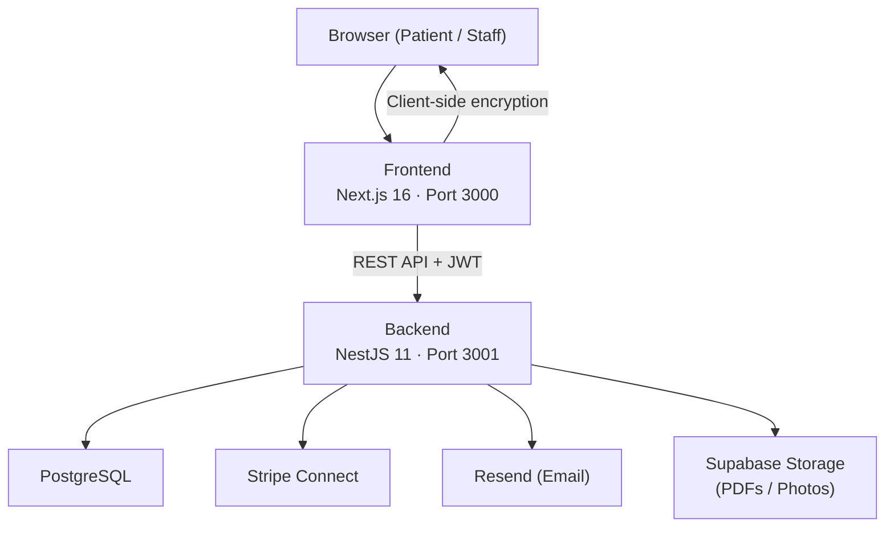
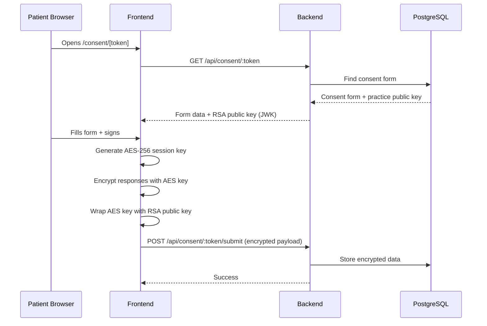
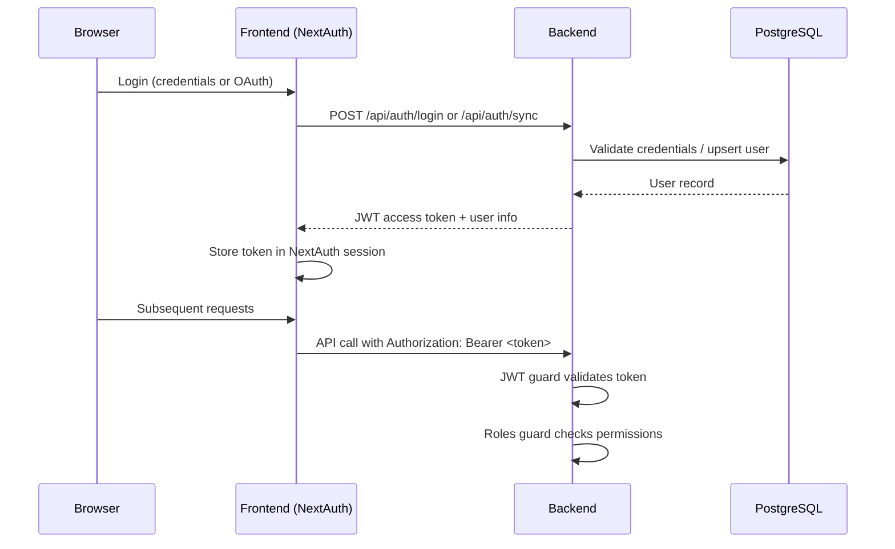

# Architecture

Derma Consent is a pnpm monorepo with two main packages and a documentation site.

## High-Level Overview



## Package Structure

```
derma-consent/
├── packages/
│   ├── frontend/          # Next.js 16 (App Router, React 19)
│   └── backend/           # NestJS 11 (REST API)
├── docs/                  # VitePress documentation
├── docker-compose.yml     # PostgreSQL for local dev
├── Makefile               # Dev commands
└── pnpm-workspace.yaml    # Monorepo config
```

## Frontend Architecture

The frontend uses **Next.js App Router** with the following layout:

```
src/
├── app/
│   ├── (authenticated)/   # Protected routes (dashboard, settings, team, etc.)
│   ├── consent/[token]/   # Public consent form
│   ├── invite/[token]/    # Public team invite
│   ├── login/             # Login page
│   └── register/          # Registration page
├── components/
│   ├── ui/                # shadcn/ui primitives
│   └── [domain]/          # Feature components (patients, team, billing, etc.)
├── hooks/                 # Custom hooks (use-vault, use-consent, etc.)
├── lib/
│   ├── auth.ts            # NextAuth 5 config (Google, Microsoft, Apple, credentials)
│   ├── auth-fetch.ts      # SWR fetch wrapper with JWT
│   └── crypto.ts          # Zero-knowledge encryption (RSA + AES)
├── i18n/
│   └── messages/          # Locale files (de, en, es, fr)
└── middleware.ts          # Route protection + locale detection
```

**Key patterns:**
- **Auth:** NextAuth 5 (beta) stores a JWT `accessToken` from the backend in the session.
- **Data fetching:** SWR with an authenticated fetch wrapper that attaches the JWT.
- **Forms:** react-hook-form + Zod for validation.
- **i18n:** next-intl with browser locale detection, stored in a cookie.

## Backend Architecture

The backend follows standard **NestJS module conventions:**

```
src/
├── auth/           # JWT strategy, guards, roles decorator
├── consent/        # Consent form CRUD + public submission
├── patient/        # Encrypted patient records
├── practice/       # Practice management
├── team/           # Team invites and member management
├── billing/        # Stripe Connect integration
├── audit/          # Audit log queries + CSV export
├── analytics/      # Dashboard metrics
├── pdf/            # PDFKit consent form generation
├── email/          # Resend email service
├── settings/       # Practice settings (branding, consent config)
├── gdt/            # GDT format export (German medical data exchange)
├── photo/          # Treatment photo management
├── treatment-plan/ # Treatment plan CRUD
└── common/         # Shared guards, interceptors, decorators
```

Each module follows the pattern: `*.module.ts` → `*.controller.ts` → `*.service.ts` + DTOs validated with `class-validator`.

## Data Flow: Consent Form Submission



## Authentication Flow


