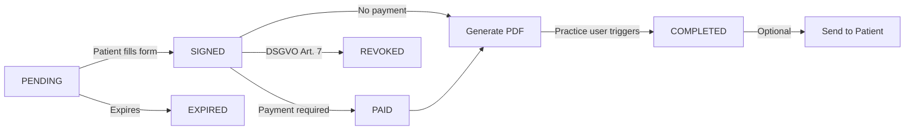
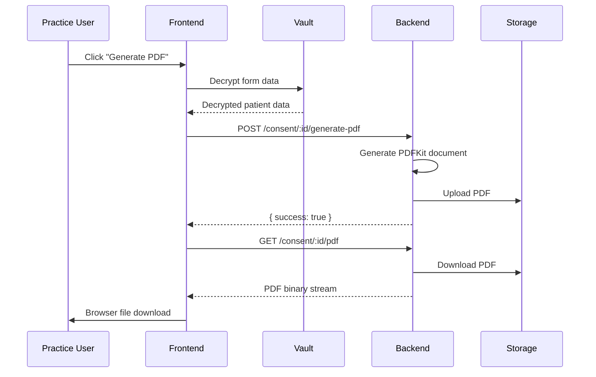

# Consent Documents

DermaConsent generates professional, legally compliant PDF consent documents for every completed consent form. This guide explains the document lifecycle, how to generate and manage documents, and how to send them to patients.

## Document Lifecycle

Every consent form follows a defined lifecycle. The PDF document is generated when a practice user explicitly triggers it from the dashboard.

::: info Key Points
- PDFs are generated **on demand** by practice users (ADMIN or ARZT roles), not automatically
- The vault must be unlocked to generate a PDF (patient data is decrypted client-side)
- Once generated, the consent status transitions to **COMPLETED**
- PDFs can be regenerated at any time (e.g., after updating practice logo or address)
:::

## Generating a PDF

### Step 1: Open the Consent Detail

Click any consent row in the dashboard table to open the detail modal. The modal has three tabs: **Form Data**, **PDF Document**, and **Send to Patient**.

### Step 2: Navigate to the PDF Tab

Click the **PDF Document** tab. If no PDF exists yet, you'll see a "Generate PDF" button.

### Step 3: Unlock the Vault

If the vault is locked, a password prompt will appear. Enter your master password to unlock it. The vault auto-locks after 15 minutes of inactivity.

### Step 4: Generate

Click **Generate PDF**. The system will:
1. Decrypt the patient's form responses client-side using the vault
2. Send the decrypted data to the backend
3. Generate a professional multi-page PDF
4. Store the PDF securely
5. Download the file to your browser

## PDF Content

The generated PDF is a professional German medical consent document (**Einwilligungserklärung**) with the following structure:

### Page 1: Letterhead + Patient Responses

| Section | Content |
|---------|---------|
| **Letterhead** | Practice logo, name, address, phone, email, website |
| **Title** | "Einwilligungserklärung" with treatment type |
| **Patient Info** | Name, date of birth, consent date, reference number |
| **Q&A Table** | Structured table with all form fields and patient answers |

The Q&A table renders every field from the consent form:
- Treatment areas (localized labels)
- Allergies (with translated allergen names)
- Medications
- Medical conditions
- Type-specific fields (e.g., Fitzpatrick skin type for laser, peel depth for chemical peels)
- Boolean fields displayed as "Ja" / "Nein"

### Page 2: Consent Declaration + Signature

| Section | Content |
|---------|---------|
| **Declaration** | Legal text confirming verbal explanation per § 630e BGB |
| **DSGVO Notice** | Data controller, legal basis, 10-year retention, withdrawal rights |
| **Signature** | Patient's digital signature in a bordered box |
| **Signature Lines** | Ruled lines for patient and physician countersignature |

### Page 3: Verification & Audit Trail

| Section | Content |
|---------|---------|
| **Audit Data** | Consent UUID, timestamp, IP address, user agent, digital fingerprint |
| **QR Code** | Links to the public verification page |
| **Verification URL** | Direct link for manual verification |

### Design & Branding

- **Fonts**: Noto Sans (embedded, supports all 8 languages including Arabic)
- **Brand Color**: Practice's configured brand color used for accent band, section headers, and title
- **Bilingual**: For non-German locales, section headers appear in both German and the patient's language

## Viewing & Managing Documents

### The Consent Detail Modal

Click any consent row to open the detail modal with three tabs:

**Form Data Tab**
- Shows all decrypted form field values
- Displays the patient's digital signature
- Requires vault unlock

**PDF Document Tab**
- Inline PDF preview (embedded viewer)
- Download button for saving the file
- Generate button if no PDF exists yet

**Send to Patient Tab**
- Send a secure verification link to the patient via email
- Pre-fill or edit the recipient email address
- View send history

### Quick Actions

The consent table retains two quick-action buttons that don't require the modal:
- **Copy Link** — copies the consent form URL to clipboard
- **Revoke** — revokes the consent (DSGVO Art. 7(3))

## Sending to Patients

After generating a PDF, you can send the patient a notification email with a secure verification link.

::: tip DSGVO-Compliant
For privacy reasons, the email contains a **verification link** — not the actual PDF as an attachment. The patient can verify the document's authenticity at the verification page, which displays no personal data.
:::

### How to Send

1. Open the consent detail modal
2. Navigate to the **Send to Patient** tab
3. Enter the patient's email address
4. Click **Send to patient**

The patient receives a branded email with:
- Practice name and logo
- Treatment type and date
- A "View document" button linking to the verification page
- End-to-end encryption badge

### Automatic Sending

When generating a PDF with a patient email address available, the system can automatically send the verification link. This is triggered when the frontend passes the patient's decrypted email during PDF generation.

## Verification

Every generated PDF includes a QR code and verification URL pointing to a public verification page.

### What the Verification Page Shows

| Field | Description |
|-------|-------------|
| Practice name | Which practice issued the consent |
| Treatment type | Localized treatment name |
| Date signed | When the patient signed |
| Status | Current consent status (Completed, Revoked, etc.) |
| Document hash | SHA-256 hash for tamper detection |

::: warning No Patient Data
The verification page intentionally shows **no patient data** (no name, no DOB, no medical information). It only confirms that a consent document exists, was signed, and hasn't been tampered with.
:::

### QR Code

The QR code in the PDF footer encodes the verification URL. Anyone with the PDF can scan it to verify authenticity — useful for:
- Courts reviewing consent documentation
- Insurance companies verifying consent
- Patients confirming their own records

## Regeneration

PDFs can be regenerated at any time by clicking the **Generate PDF** button on a consent that already has one. This is useful when:

- The practice updates their **logo** or **address**
- A **brand color** change needs to be reflected
- The PDF format has been **improved** in a software update

The old PDF is automatically replaced. The new PDF gets a fresh document hash.

## Roles & Permissions

| Role | Can View Form | Can Generate PDF | Can Download | Can Send | Can Revoke |
|------|:---:|:---:|:---:|:---:|:---:|
| **ADMIN** | Yes | Yes | Yes | Yes | Yes |
| **ARZT** (Doctor) | Yes | Yes | Yes | Yes | Yes |
| **EMPFANG** (Reception) | No | No | No | No | No |

Reception staff can see the consent table and copy links, but cannot access encrypted data or generate documents.

## API Reference

| Endpoint | Method | Auth | Description |
|----------|--------|------|-------------|
| `/api/consent/:id/generate-pdf` | POST | ADMIN, ARZT | Generate PDF from decrypted form data |
| `/api/consent/:id/pdf` | GET | ADMIN, ARZT | Download PDF as binary stream |
| `/api/consent/:id/send-copy` | POST | ADMIN, ARZT | Send verification link to patient |
| `/api/verify/:id` | GET | Public | Verify document authenticity |
