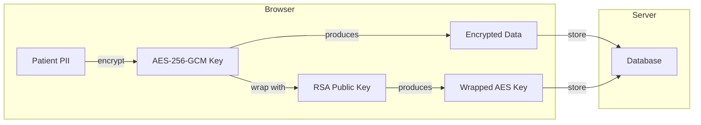
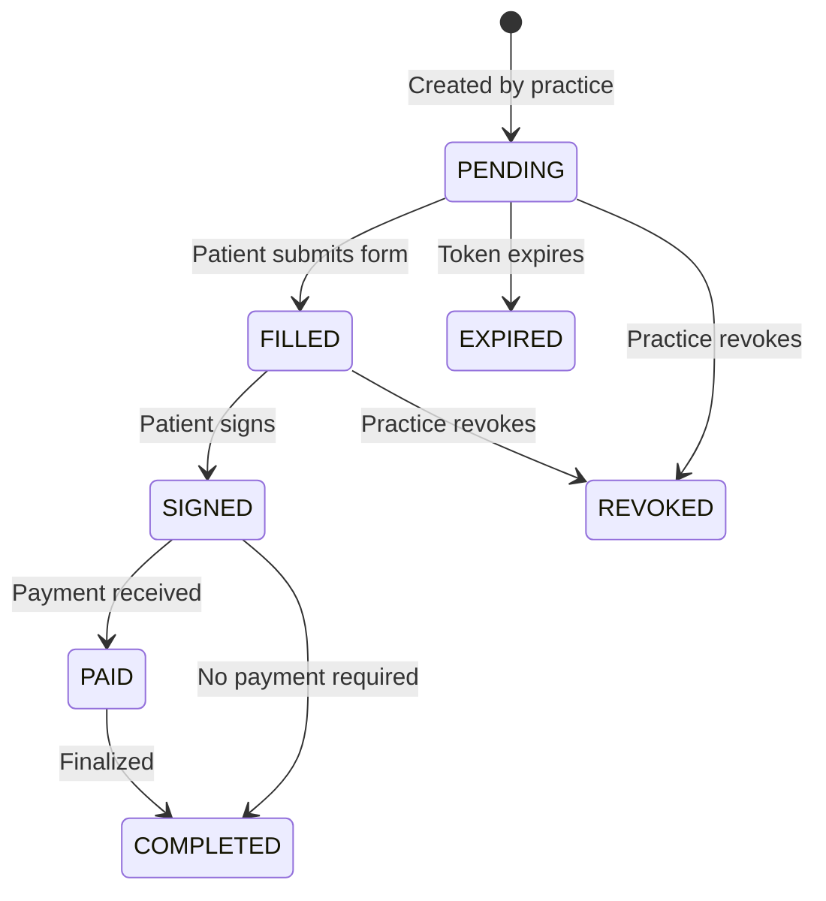

# Key Concepts

## Zero-Knowledge Encryption

The core security model of Derma Consent is **zero-knowledge encryption** — the server never sees plaintext patient data.

### How It Works

1. **Practice setup:** When a practice is created, an RSA-4096 keypair is generated in the browser. The public key is stored in the database as JWK. The private key is encrypted with the practice's master password (via PBKDF2) and stored alongside it.

2. **Encrypting data:** Each consent form submission generates a fresh AES-256-GCM session key. Patient data is encrypted with this AES key, then the AES key itself is wrapped (encrypted) with the practice's RSA public key.

3. **Decrypting data:** To view patient data, a team member unlocks the "vault" by entering the practice master password. This decrypts the RSA private key in the browser, which can then unwrap AES session keys and decrypt patient data.

4. **Lookup without decryption:** Patient deduplication uses SHA-256 hashes (`lookupHash`) — the server can check if a patient already exists without ever seeing their name or email.

### Implementation

All encryption is in `packages/frontend/src/lib/crypto.ts` using the Web Crypto API — no external cryptography libraries.

| Operation | Algorithm |
|-----------|-----------|
| Keypair generation | RSA-OAEP, 4096-bit, SHA-256 |
| Data encryption | AES-256-GCM (random 96-bit IV) |
| Key wrapping | RSA-OAEP |
| Master password derivation | PBKDF2 (100,000 iterations, SHA-256) |
| Patient lookup hash | SHA-256 |

## Consent Form Lifecycle

Every consent form moves through a defined set of statuses:

| Status | Description |
|--------|-------------|
| `PENDING` | Form created, waiting for patient |
| `FILLED` | Patient completed the form fields |
| `SIGNED` | Patient provided e-signature |
| `PAID` | Stripe payment collected (if required) |
| `COMPLETED` | Final state — PDF generated and stored |
| `EXPIRED` | Token expired before completion |
| `REVOKED` | Manually revoked by the practice |

### Public Consent Flow

1. Practice creates a consent form → generates a unique token
2. Patient opens `/consent/[token]` in their browser
3. Patient reads procedure information, fills in their details
4. Patient signs using the signature canvas
5. Browser encrypts all PII client-side, then submits
6. Backend stores encrypted data, generates PDF, updates status

## User Roles

Derma Consent has three roles with different permission levels:

| Permission | Admin | Arzt (Physician) | Empfang (Reception) |
|------------|:-----:|:-----------------:|:-------------------:|
| View dashboard | Yes | Yes | Yes |
| View patients | Yes | Yes | Yes |
| Create consent forms | Yes | Yes | Yes |
| View consent forms | Yes | Yes | No |
| Revoke consent | Yes | Yes | No |
| Create treatment plans | Yes | Yes | No |
| Manage photos | Yes | Yes | No |
| Manage team | Yes | No | No |
| Manage settings | Yes | No | No |
| Manage billing | Yes | No | No |
| View audit logs | Yes | No | No |
| View analytics | Yes | Yes | No |
| View revenue analytics | Yes | No | No |

## Consent Types

Six procedure-specific consent types, each with tailored form fields and risk disclosures:

| Type | Description |
|------|-------------|
| `BOTOX` | Botulinum toxin injections |
| `FILLER` | Dermal filler injections |
| `LASER` | Laser treatments (resurfacing, hair removal, etc.) |
| `CHEMICAL_PEEL` | Chemical peel procedures |
| `MICRONEEDLING` | Microneedling / collagen induction therapy |
| `PRP` | Platelet-rich plasma therapy |

## Audit Logging

Every sensitive operation is recorded in the audit log with:

- **Timestamp** — when the action occurred
- **User** — who performed it
- **Action** — what happened (e.g., `CONSENT_CREATED`, `VAULT_UNLOCKED`)
- **Entity** — which record was affected
- **IP address** — origin of the request
- **Metadata** — additional context (JSON)

Audit logs can be queried by action type and date range, and exported as CSV for compliance reviews.
