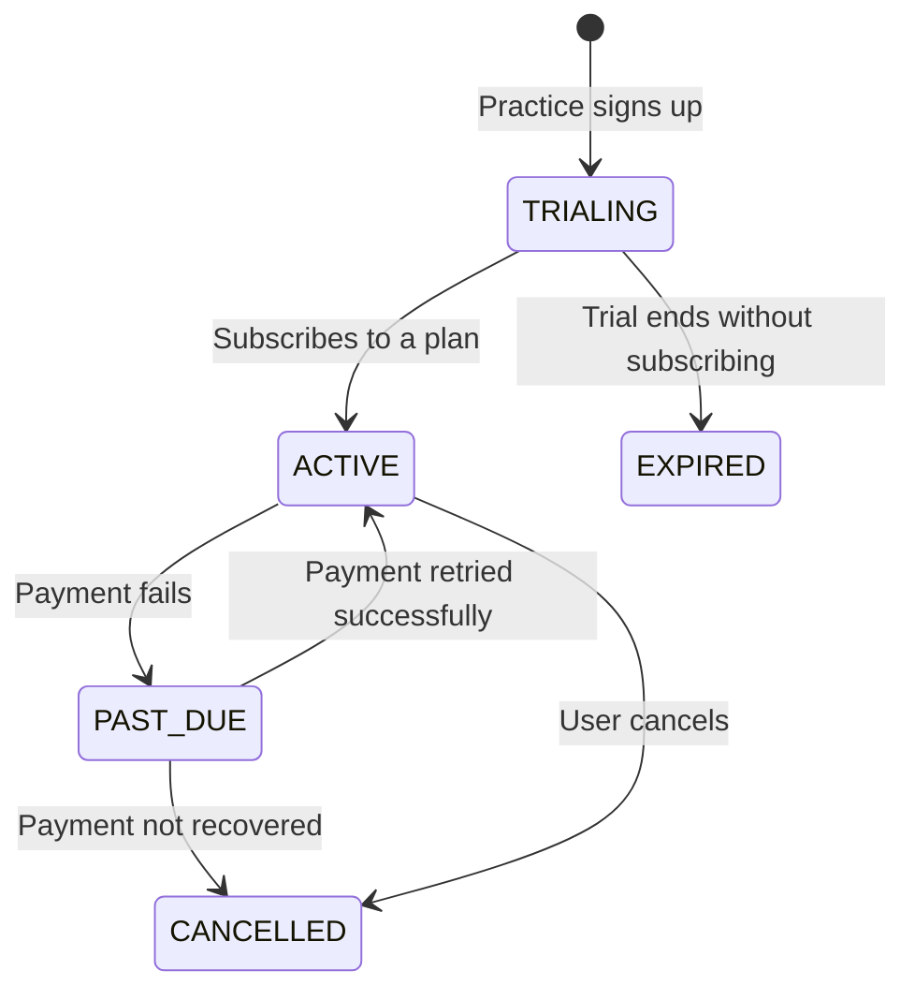

# Billing Plans

Derma Consent uses **Stripe Connect** for billing. Practices are Stripe connected accounts.

## Subscription Plans

| Plan | Description |
|------|-------------|
| **FREE_TRIAL** | 14-day full-feature trial for new practices |
| **STARTER** | Basic plan for small practices |
| **PROFESSIONAL** | Advanced features for growing practices |
| **ENTERPRISE** | Full feature set for multi-location practices |

## Subscription Statuses

| Status | Description |
|--------|-------------|
| `TRIALING` | Within the free trial period |
| `ACTIVE` | Subscription is active and payments are current |
| `PAST_DUE` | Payment failed — grace period before cancellation |
| `CANCELLED` | Subscription has been cancelled |
| `EXPIRED` | Trial or subscription has expired |

## Subscription Lifecycle

## Stripe Integration

### Checkout Flow

1. Admin clicks "Subscribe" in the billing page
2. Frontend calls `POST /api/billing/checkout` with the selected plan
3. Backend creates a Stripe Checkout session
4. User completes payment on Stripe's hosted page
5. Stripe webhook notifies the backend
6. Subscription is activated

### Customer Portal

Admins can manage their subscription (change plan, update payment method, cancel) via the Stripe Customer Portal:

1. Frontend calls `POST /api/billing/portal`
2. Backend returns a Stripe portal URL
3. User is redirected to manage their subscription

### Webhooks

The webhook handler at `POST /api/billing/webhook` processes:

- `checkout.session.completed` — new subscription
- `invoice.paid` — successful payment
- `invoice.payment_failed` — failed payment
- `customer.subscription.updated` — plan change
- `customer.subscription.deleted` — cancellation

## Configuration

Billing requires these environment variables:

| Variable | Description |
|----------|-------------|
| `STRIPE_SECRET_KEY` | Stripe secret API key |
| `STRIPE_WEBHOOK_SECRET` | Webhook signing secret |
| `STRIPE_PLATFORM_FEE_PERCENT` | Platform fee (default: 5%) |
| `NEXT_PUBLIC_STRIPE_PUBLISHABLE_KEY` | Frontend publishable key |

Leave all Stripe variables empty to run without billing features.
